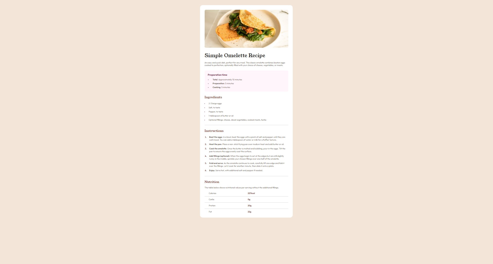

# Frontend Mentor - Recipe page solution

This is a solution to the [Recipe page challenge on Frontend Mentor](https://www.frontendmentor.io/challenges/recipe-page-KiTsR8QQKm).

### Screenshot

### Links

- Solution URL: [Add solution URL here](https://your-solution-url.com)
- Live Site URL: [Add live site URL here](https://your-live-site-url.com)
- Personal Website - (https://leviipope.github.io/cv-website)
- Frontend Mentor - [@leviipope](https://www.frontendmentor.io/profile/leviipope)

### Built with

- Semantic HTML5 markup
- CSS custom properties
- Flexbox

**Note: Learned about ::marker element and improved my flexbox skills**

